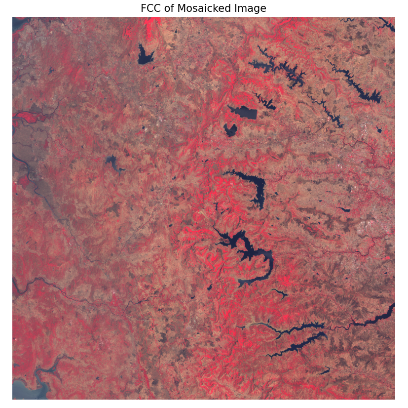
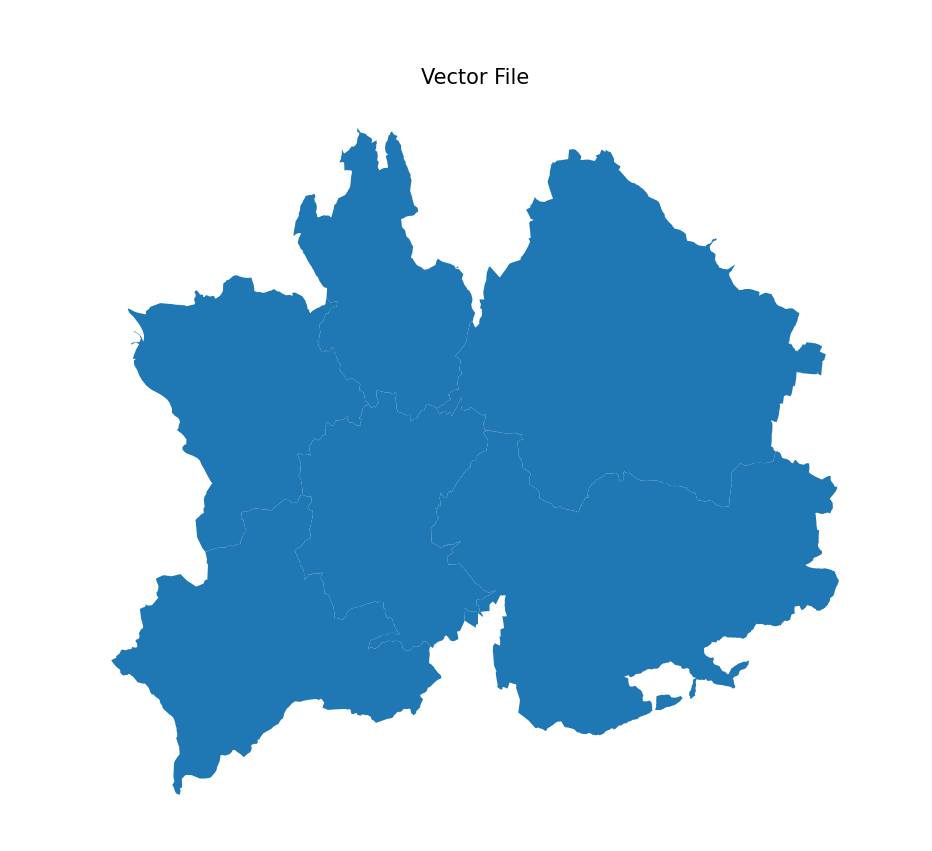
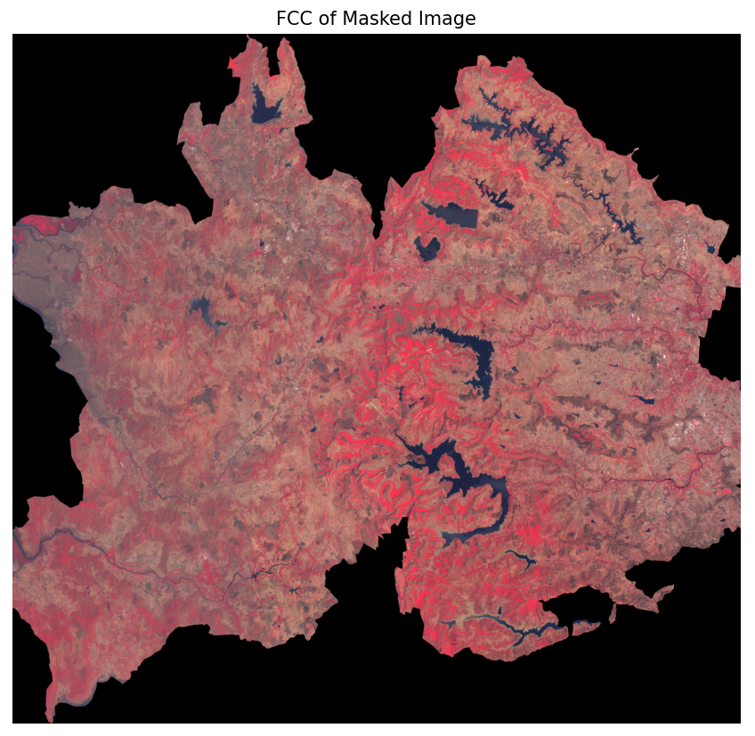

## Mosaic
Create the virtual environment inside the image mosaic folder

Download the gdal wheel file from https://github.com/cgohlke/geospatial-wheels/releases and install using pip install <gdal downloaded directory>. 
Eg: pip install C:\Users\user\Downloads\gdal-3.10.2-cp310-cp310-win_amd64.whl

Requirements are matplotlib, numpy, gdal, os, rasterio, fiona, install these libraries using pip install <library_name>

Place your image's bands will be seperate folder (manually collect the all image's 1st band to data/inputs/satellite_images/Band_x)**. 
If image has more bands then create folder in data/inputs/satellite_images/Band_y...etc. Eg: Your study required 5 images each has 6 bands, 
then u have to create 6 seperate folders, each should have the bands. 

Input images are already provided in the data/inputs/satellite_images/Band_1,2,3,4 folders to mosaic the image's bands, run the ''main.py'' file or in terminal run this "python main.py" the mosaicked output will be available in the data/mosaic_output folder also will be appeard as FCC in the window after the running has finished.
The output image's FCC is given below

  
  

## Masking using the .shp file
to clip the mosicked image using the shape file, run the clip_using_mask.py file or run 'python clip_using_mask.py' in terminal. 
before that you should paste your shape file and associated files in the folder data\inputs\aoi_shape_file\shape_file. 
Now run the 'clip_using_mask.py', the clipped output will be saved in data\clipped_output folder for the each band of masaicked images.
The output of the clipped image look like below given image

  
  

